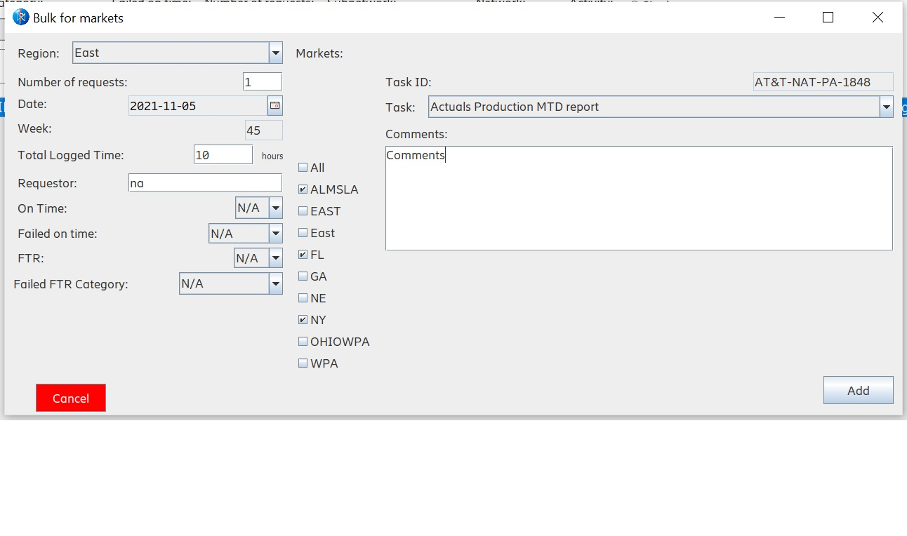

# MRT

 Metrics Recording Tool
 
## Modules

So far this project has 7 modules (**Admin, COP, FMS, Scoping, Sourcing, PSS & VSS**)

> ### Admin module
>

> ### Reporting time modules
>
> These functionalities are implemented in all of the modules:
> 
> #### Record working time view 
> 
> > **Insert a row using all of the filtered elements the tool displays per team**
> >
> > The data will be filtered according to specific elements, i.e. *CU -> Task -> Task ID, SAP Billing -> Task -> Task ID, SAP Billing -> Subnetwork -> Network -> Activity, Date -> Week*

> 
> > **Delete one or multiple rows in the table**
> >
> > If a row or multiple rows are selected these will be removed, and if there is no selection the bottom row will be deleted. *This functionality is also implemented on the Edit working time panel.*

>
> > **Clear table and filters**
> >
> > This will remove all rows in the table and set all filters and text fields to the start values. *This functionality is also implemented on the Edit working time panel.*

> 
> > **Save**
> > 
> > Save all rows in the table into the team's metrics table, before that the tool will validate for matching information, i.e. *CU - Task - Task ID, Work date - Week, Subnetwork - Network - Activity - SAP Billing* and *FTR, On Time, Failed FTR Category and Failed on time* should be in the dropdown list.

> 
> > **Single & Bulk selection**
> > 
> > If *Single* is selected a row will be inserted into the table with the selected data. If *Bulk* is selected a spinner item will show and the selected number will be the amount of rows that will be inserted, the time and number of requests will be divided by this number and the rest of the filters will remain the same.

>
> > **Saved hours per day**
> >
> > In the upper right corner there is a little table with the days of the week, each will display the amount of time saved in that day. If the selected date changes the week field, this will also change this table to match the selected week. *This functionality is also implemented on the Edit working time panel.*

>
> #### Custom functionalities
> >
> > **Market bulk**
> >
> > This option shows a new frame which comes with new filters, it will show the available markets depending on the selected region and divide the time by all the different networks in those markets. This option will put the same number of requests inserted in the field per row.

>
> #### Edit working time view
> 
> > **History**
> >
> > It will open a small frame where the team must be selected and also the start and finish date. Once the Search & Export button is hit it will run the query and open an Excel file with the results.

>
> > **Search**
> >
> > This will take the selected filters to perform the search, there is a checkbox in case the search needs to be filtered by week rather than by a specific day. The fetched information will be displayed in the table.

>
> For the next functionalities the Search functionality needs to be run first:
> > **Delete one or multiple rows**
> >
> > This functionality is basically the same as the one in Record working time panel with a slightly difference, since the information in the table is coming from the database, this button will delete permanently the row(s) selected in the database.
>
> > **Update**
> >
> > If changes were made to one or more rows this will compare the new rows with the previous ones to update the right ones in the database. If nothing change a message will pop up.
>
> > **Export in ESS format**
> > 
> > This will sum all the time in a specific network and activity and put it in the right day to reduce lines when inserting those into SAP. This allows copy & paste from Excel to SAP.
>
> > **Export table**
> >
> > All the rows in the table will be exported to an Excel file (this includes the row id from the database).
>

> #### Teams *menu item*
> > **Teams**
> >
> > The teams displayed depend on what the user has in the Team and Supporting_Team columns in the database.
>

> File *menu item*:
> > **Create CSV**
> >
> > Creates a csv file taking the first 2 tasks available for the user, this provides the correct structure for the user to upload his/her metrics and avoid errors.
>
> > **Import CSV**
> >
> > Imports a CSV file structured as the one the tool creates, if this file contains a different structure it will not be displayed in the tool table and will show an error message.
>
> > **Save as template**
> >
> > All the  rows in the table at the moment will be saved to a file (whis is not meant for the user to edit). Every time the user clicks on this option the file will be overwritten.
>
> > **Used saved template**
> >
> > This will check the specific location for the saved template and import its contents to the tool's table, in case there is no file this will not perform any action.
>

> #### About *menu item*
>
> > This view displays the history behind MRT, how it was conceived, the logo, the meaning and its philosophy. It also shows the current version of the tool.